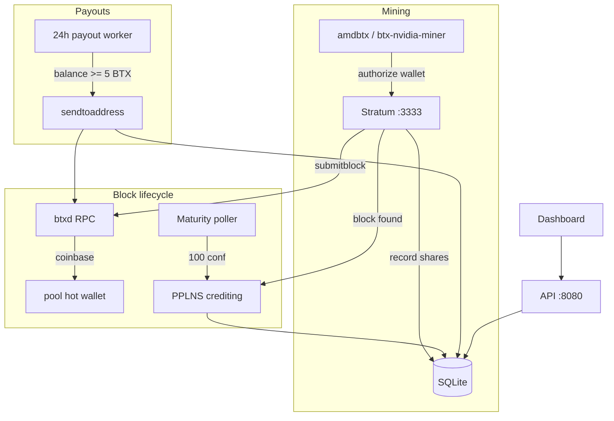

# Production Pool Plan — PPLNS, Payouts, Miner Dashboard

## Goal

Turn btxpool into a **production-ready public pool** with:

| Requirement | Value |
|-------------|-------|
| Payment mode | **PPLNS** (Pay Per Last N Shares) |
| Pool / dev fee | **1%** retained by operator |
| Dev fee address | `btx1z0069dewdztkwnrxx97lt9c5paynh0nynegqxq2kgykh0ct8xaggq0953gx` |
| Payout interval | **Every 24 hours** |
| Minimum payout | **5 BTX** (`500_000_000` sats, 8 decimals) |
| Miner clients | [amdbtx](https://github.com/thekillsquad007/amdbtx), [btx-nvidia-miner](https://github.com/thekillsquad007/btx-nvidia-miner) |
| Dashboard | Pool overview + **per-wallet** worker view |

---

## Current Gaps

- Block rewards go 100% to `pool_address`; miner stratum usernames are **stats only**.
- `split_coinbase_value` / `dev_fee_bps` exist in `block_builder.py` but are **not wired** in `job_manager.py` or `stratum/server.py`.
- `pool_fee_percent` is **UI-only** (`api.py`).
- No balance ledger, maturity tracking, or on-chain payouts.
- No per-wallet API or frontend route.

---

## Architecture



---

## 1. Configuration

Extend `config.py` / `config.example.yaml`:

```yaml
# Payment
payment_mode: "pplns"           # only pplns for now
pool_fee_percent: 1.0           # deducted from distributable reward
dev_fee_address: "btx1z0069dewdztkwnrxx97lt9c5paynh0nynegqxq2kgykh0ct8xaggq0953gx"

pplns_window_multiplier: 2.0  # window = multiplier × network difficulty (share units)
coinbase_maturity: 100        # blocks before reward is payable

payout_interval_hours: 24
min_payout_sats: 500000000    # 5 BTX
payout_enabled: true
```

**Operator setup (document in README):**

- `btxd` synced, `server=1`, **wallet enabled**
- `pool_address` = hot wallet that receives coinbase (can match `dev_fee_address`)
- RPC user must be allowed `sendtoaddress`, `getblock`, `gettransaction`
- Import/create wallet address before first block

**Fee model (1% total):**

- Coinbase split when `dev_fee_address` ≠ `pool_address`: 99% pool / 1% dev via `dev_fee_bps=100`.
- When addresses are the **same** (your setup): 100% coinbase to pool wallet; PPLNS credits miners **99%** of mature block reward; **1%** stays in operator balance (not credited to miners).
- PPLNS always uses `distributable_sats = reward_sats * (10000 - pool_fee_bps) // 10000`.

---

## 2. Database Schema

New tables in `database.py` (with migrations):

### `mining_rounds`
| Column | Purpose |
|--------|---------|
| `id` | Round PK |
| `block_id` | FK → `blocks.id` |
| `height`, `hash` | Chain reference |
| `reward_sats`, `distributable_sats` | Gross / after fee |
| `window_work` | Total difficulty in PPLNS window |
| `status` | `pending` → `immature` → `mature` → `credited` |
| `confirmations`, `credited_at` | Maturity tracking |

### `round_credits`
| Column | Purpose |
|--------|---------|
| `round_id`, `address` | Per-wallet credit for one round |
| `work`, `percent`, `amount_sats` | PPLNS allocation |

### `miner_balances`
| Column | Purpose |
|--------|---------|
| `address` PK | Miner payout wallet |
| `immature_sats` | Credited but block not mature |
| `balance_sats` | Mature, not yet paid |
| `paid_total_sats` | Lifetime payouts |
| `updated_at` | |

### `payouts`
| Column | Purpose |
|--------|---------|
| `id`, `address`, `amount_sats`, `txid` | On-chain payout record |
| `status` | `pending` / `sent` / `failed` |
| `created_at`, `error` | |

### Extend `blocks`
- `hash` (populate on submit), `status`, `confirmations`, `round_id`
- Store `finder_address` (already exists)

### Extend `shares` (optional index)
- Index on `(created_at DESC)` for fast PPLNS window walks

---

## 3. PPLNS Engine — `pool/pplns.py`

**On block accepted** (`stratum/server.py` after successful `submitblock`):

1. Persist block with hash (from assembled block or `getblock`).
2. `reward_sats` = `coinbasevalue` from GBT at find time.
3. `distributable_sats` = apply `pool_fee_percent`.
4. Compute window target: `window_work_target = network_difficulty * pplns_window_multiplier`.
5. Walk `shares` newest-first, accumulate `difficulty` until `sum >= window_work_target`.
6. For each share in window, credit `address` (not worker):  
   `amount = distributable_sats * share.difficulty / window_work_total`.
7. Insert `mining_rounds` + `round_credits`; add to `miner_balances.immature_sats`.
8. Log round summary (finder bonus: none — pure PPLNS).

**Maturity poller** (background thread in `__main__.py`):

- Every ~60s, for rounds with `status != credited`:
  - `getblock` / `gettransaction` → update `confirmations`
  - When `confirmations >= coinbase_maturity`: move `immature_sats` → `balance_sats` per address, mark round `credited`

---

## 4. Dev Fee in Coinbase

**`job_manager.py`:**
- Add `resolve_dev_script()` (same RPC pattern as `resolve_pool_script`).
- Pass `dev_script` + `dev_fee_bps` into `compute_template_merkle_root` when addresses differ.

**`stratum/server.py` `_submit_block`:**
- Pass dev fee params into `assemble_block_hex`.

When `dev_fee_address == pool_address`, skip coinbase split (fee handled in PPLNS only).

---

## 5. Payout Worker — `pool/payouts.py`

Background thread, runs every `payout_interval_hours`:

1. Skip if `payout_enabled: false` or wallet not ready.
2. Query `miner_balances` where `balance_sats >= min_payout_sats`.
3. For each address:
   - `sendtoaddress(address, amount_btx)` via `btx_rpc.py`
   - On success: insert `payouts`, decrement `balance_sats`, increment `paid_total_sats`
   - On failure: log, mark `failed`, retry next cycle
4. Persist `last_payout_at` in `pool_stats`.

**Safety:**
- Single-flight lock (no concurrent payout runs)
- Subtract estimated tx fee from payout amount or use `subtractfeefromamount`
- Dry-run mode via `payout_dry_run: true` for testing

---

## 6. API Endpoints

| Endpoint | Description |
|----------|-------------|
| `GET /api/pool` | Add `payment_mode`, `min_payout_btx`, `payout_interval_hours`, `next_payout_eta` |
| `GET /api/wallet/{address}` | Per-wallet dashboard |
| `GET /api/payouts?address=` | Payout history (optional filter) |
| `GET /api/rounds?limit=` | Recent PPLNS rounds (pool admin view) |

### `GET /api/wallet/{address}` response

```json
{
  "address": "btx1z...",
  "balance_btx": 12.5,
  "immature_btx": 3.2,
  "paid_total_btx": 100.0,
  "workers": [
    { "canonical_name": "btx1z....rig01", "shares_valid": 1200, "hashrate": "2.1 kH/s", "last_seen": ... }
  ],
  "recent_credits": [...],
  "recent_payouts": [...],
  "min_payout_btx": 5,
  "next_payout_eta": "2026-06-12T00:00:00Z"
}
```

Validate address format (`btx1z...`) before query.

---

## 7. Frontend — Per-Wallet Dashboard

**`frontend/src/App.tsx`** (or split `WalletPage.tsx`):

- Route: `/wallet/:address` (React Router or hash route `#/wallet/btx1z...`)
- Wallet lookup form on main page (“Check your balance”)
- Show: balance, immature, paid total, workers table, payout history, PPLNS credits
- Pool home: show fee %, min payout, payout schedule in connect card
- Link workers to wallet page

Rebuild `frontend/dist` after changes.

---

## 8. Production Docs — `README.md`

Add sections:

### For miners
- Stratum URL, username = `btx1z...` or `btx1z....workername`
- **amdbtx** `config.yaml` example
- **btx-nvidia-miner** CLI example (already partial in UI)
- PPLNS explanation, 1% fee, 24h payouts, 5 BTX minimum
- Link to wallet dashboard: `http://POOL_IP:8080/wallet/btx1z...`

### For pool operator
- btxd wallet setup (`btx-cli createwallet`, import address)
- Required RPC permissions
- Backup `data/pool.db`
- Firewall: expose 3333 (stratum), 8080 (dashboard)
- `scripts/deploy.sh` updates for fee/payout config

---

## 9. Deploy Script Updates

`scripts/deploy.sh`:
- `--fee-percent 1`
- `--dev-address`
- `--min-payout-btx 5`
- Write new config keys into generated `config.yaml`

---

## 10. Testing Plan

1. **Unit tests** for PPLNS window math and fee split (`tests/test_pplns.py`)
2. **Integration** with `payout_dry_run: true` — simulate block find, verify credits in DB
3. **Manual**: mine with 2 wallets, verify `/api/wallet/{addr}` shows separate balances
4. **Regression**: existing stratum share acceptance unchanged

---

## 11. Implementation Order (PR-sized chunks)

| Step | Files | Est. |
|------|-------|------|
| 1 | Schema + migrations | `database.py` |
| 2 | Config defaults | `config.py`, `config.example.yaml` |
| 3 | Dev fee coinbase wiring | `job_manager.py`, `stratum/server.py` |
| 4 | PPLNS crediting | `pool/pplns.py`, hook in `server.py` |
| 5 | Maturity poller | `pool/pplns.py`, `__main__.py` |
| 6 | Payout worker | `pool/payouts.py`, `btx_rpc.py` helpers, `__main__.py` |
| 7 | API wallet endpoint | `api.py` |
| 8 | Frontend wallet page | `frontend/src/*` |
| 9 | README + deploy script | `README.md`, `scripts/deploy.sh` |
| 10 | Tests | `tests/test_pplns.py` |

---

## 12. Out of Scope (follow-ups)

- **PPS** payment mode
- Email/push payout notifications
- Admin auth for payout triggers
- btx-nvidia-miner metrics fix (nonce/s inflation) — separate repo PR
- Push amdbtx metrics fixes to GitHub

---

## Operator Checklist Before Going Live

- [ ] btxd synced, wallet funded for tx fees
- [ ] `pool_address` in wallet, can `sendtoaddress`
- [ ] `config.yaml` with fee, payout, dev address
- [ ] Solver built and `solver_path` set
- [ ] Ports 3333 + 8080 reachable
- [ ] `data/pool.db` backup plan
- [ ] Restart pool after deploy